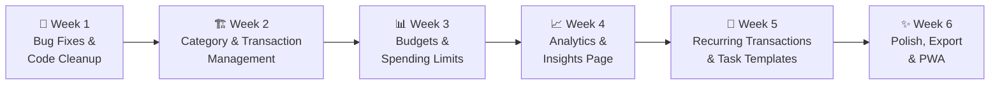

# DASHBOARD v1.5+ — Implementation Plan

> **Work Schedule**: Sunday – Thursday | **Off**: Friday – Saturday
> **Branch**: `dev-branch-v1.5`
> **Starting**: Week of Sep 14, 2026

---

## Current State Summary

The dashboard is a **personal life OS** with 4 core modules — Home (daily brief), Finance (net worth, wallets, transactions, categories), Schedule (FullCalendar planner), and Profile (settings). It's built on **Next.js 16 App Router + Supabase + TanStack Query + Tailwind 4 + shadcn/ui**.

After a deep audit, I found **12 bugs/dead-code items** and identified **6 high-impact feature opportunities**. The plan below is organized into weekly sprints prioritized by: bugs first → complete half-built features → new capabilities.

---

## User Review Required

> [!IMPORTANT]
> **Feature selection**: The sprints below are suggestions based on what makes architectural sense to build in order. Please review and tell me which features you actually want, and I'll adjust the plan accordingly.

> [!IMPORTANT]
> **Supabase migrations**: Several features (budgets, recurring transactions) require new database tables. You'll need to run migrations against your Supabase project. I can generate the SQL, but you'll need to apply them.

---

## Open Questions

> [!IMPORTANT]
> 1. **Budgets**: Do you want per-category monthly budgets, or a single overall monthly spending limit, or both?
> 2. **Recurring transactions**: Should these auto-create on their scheduled date, or just prompt you to confirm each one?
> 3. **Data export**: CSV only, or also PDF reports?
> 4. **Category management**: When deleting a category, should its transactions become "Uncategorized" or should they be reassigned to another category?
> 5. **Mobile priority**: Is the mobile experience a priority, or is this primarily a desktop dashboard?
> 6. **Which features excite you the most?** I can reorder the sprints based on what you're eager to ship first.

---

## Sprint Overview



---

## Week 1 — Bug Fixes & Code Cleanup *(Sep 14–18)*

Clean foundation before building new features. These are all issues found during the audit.

### Bugs to Fix

#### [MODIFY] `src/app/(main)/finance/add/wallet/page.tsx`
**Copy-paste title bug** — Page header says "Add Category" instead of "Add Wallet".
```diff
- <PageHeader title="Add Category" />
+ <PageHeader title="Add Wallet" />
```

#### [MODIFY] `src/lib/actions/toggleTasks.ts`
**Cache invalidation typo** — `updateTag('planner-tasks=${user.id}')` uses `=` instead of `-`, silently failing to bust the cache.
```diff
- updateTag('planner-tasks=${user.id}')
+ revalidateTag(`planner-tasks-${user.id}`)
```

#### [MODIFY] Transaction Optimistic Delete (Broken Feature)
`DeleteTransactionItem.tsx` dispatches `optimistic-transaction-delete` and `optimistic-transaction-restore` events, but **no component listens to them**. Fix by adding event listeners in:
- `src/app/(main)/finance/transaction-history/client.tsx`
- `src/components/Expenses/RecentLogsSection.tsx`
- `src/app/(main)/finance/accounts/[accountId]/client.tsx`

#### [MODIFY] `src/app/(main)/finance/viewAllCategories/action.ts`
**Multi-currency sum bug** — Raw amounts from different currencies are added together. Fix by grouping totals per currency, or filtering to the user's active currency.

#### [MODIFY] `src/app/(main)/schedule/action.ts`
**Console.log in production** — Remove `console.log(data)` on line 162.

#### [MODIFY] `src/app/(main)/profile/action.ts`
**Double-await bug** — `await (await supabase).from('profiles')` has a redundant nested await.

#### [MODIFY] `src/lib/actions/seed.ts`
**Schema mismatch** — Inserts `title` property on transactions, but the column is `note`.

#### [MODIFY] `src/app/api/seed/route.ts`
**Security risk** — No auth check or environment guard. Add `NODE_ENV !== 'production'` check.

---

### Dead Code Removal

| File / Directory | Status | Action |
|---|---|---|
| `src/components/Home/NetWorthOverview.tsx` | Orphaned, never imported | Delete |
| `src/components/Home/WeatherCard.tsx` + `WeatherCardSkeleton.tsx` | Replaced by inline code in `GreetingHeader` | Delete |
| `src/components/Navbar/Navbar.tsx` | Replaced by `Sidebar.tsx` + `Mobilebar.tsx` | Delete |
| `src/components/Modals/PlannerModals/task-deleteModal/DeleteTaskModal.tsx` | Replaced by `DeleteTaskButton.tsx` | Delete |
| `src/components/Shared/MobileScheduleCalendar.tsx` | Unreachable (`CustomC = true`) | Delete |
| `src/app/(main)/finance/viewAllAccounts/[accountId]/` | Duplicate of `accounts/[accountId]/` | Delete, fix links in `viewAllAccounts/client.tsx` |
| `src/components/Modals/add-transaction/` | Empty orphaned directory | Delete |
| `src/lib/graphqlClient.ts` | Never used, no GraphQL endpoint exists | Delete |
| `graphql` + `graphql-request` in `package.json` | Unused dependencies | Remove |
| Dead code block in `schedule/client.tsx` (lines 60–138) | Unreachable (`CustomC = true`) | Delete |
| `src/contexts/SyncStatusContext.tsx` | Redundant with Zustand `syncStore.ts` | Delete, consolidate |
| `src/config/constants/.gitkeep` | Empty placeholder | Delete directory |

---

### Consistency Fixes

| Issue | Fix |
|---|---|
| `WalletCard.tsx` uses `text-red-400` for negative | Change to `text-rose-500` to match everywhere else |
| `.micro-label` utility used in 2 files, manually composed everywhere else | Adopt `.micro-label` class consistently |
| Inconsistent `PageHeader` placement (some in `page.tsx`, some in form components) | Standardize to `page.tsx` level |
| Missing env vars in `.env.example` | Add `OPENWEATHER_API_KEY`, fix `ANON_KEY` → `PUBLISHABLE_KEY` |

---

## Week 2 — Category & Transaction Management *(Sep 21–25)*

Complete the half-built category and transaction features.

### Category Management (Currently read-only cards with no interaction)

#### [NEW] `src/components/Modals/EditCategory/EditCategoryModal.tsx`
Edit modal mirroring `AddCategoryForm` — icon picker, color palette, name input, live preview.

#### [NEW] `src/components/Modals/DeleteCategory/DeleteCategoryModal.tsx`
Destructive AlertDialog. Reassigns transactions to "Uncategorized" (or user-chosen category).

#### [NEW] `src/lib/actions/transactions/update-category.ts` + `delete-category.ts`
Server actions for category CRUD. Cache invalidation on `categories-${userId}`.

#### [MODIFY] `src/app/(main)/finance/viewAllCategories/client.tsx`
Make category cards clickable → open `EditCategoryModal`. Add context menu with Edit/Delete.

#### [NEW] Category Detail Drilldown Page
`src/app/(main)/finance/categories/[categoryId]/` — Shows category header (icon, color, name, total spent), and a filtered transaction list for that category. Reuse the transaction table from `transaction-history/client.tsx`.

---

### Transaction Editing

#### [NEW] `src/components/Modals/EditTransaction/EditTransactionModal.tsx`
Dialog to edit an existing transaction's note, amount, date, category, and wallet. Pre-fills current values.

#### [NEW] `src/lib/actions/transactions/update-transaction.ts`
Server action handling amount changes (rebalancing wallet amounts), category reassignment, and date changes.

#### [MODIFY] `src/components/Shared/TransactionActionsMenu.tsx`
Add "Edit Transaction" option alongside existing "Delete Transaction".

---

## Week 3 — Budgets & Spending Limits *(Sep 28 – Oct 2)*

### New Database Schema

```sql
-- New Supabase table
CREATE TABLE budgets (
  id UUID PRIMARY KEY DEFAULT gen_random_uuid(),
  user_id UUID REFERENCES profiles(id) ON DELETE CASCADE,
  category_id UUID REFERENCES expense_categories(id) ON DELETE CASCADE,
  amount NUMERIC NOT NULL,
  currency VARCHAR NOT NULL,
  period VARCHAR NOT NULL DEFAULT 'monthly', -- 'monthly' | 'weekly'
  created_at TIMESTAMPTZ DEFAULT now(),
  UNIQUE(user_id, category_id, currency, period)
);
```

#### [NEW] `src/types/budget.ts`
TypeScript types for `Budget`, `BudgetWithSpent`.

#### [NEW] `src/lib/actions/budgets/`
CRUD server actions: `create-budget.ts`, `update-budget.ts`, `delete-budget.ts`, `get-budgets.ts`.

#### [NEW] `src/components/Modals/SetBudget/SetBudgetModal.tsx`
Modal to set a monthly spending limit for a category. Amount input + category selector.

#### [MODIFY] `src/components/Expenses/CategorySection.tsx`
Add budget progress bars below category badges. Color-coded: green (<70%), amber (70-90%), rose (>90%).

#### [NEW] `src/app/(main)/finance/budgets/` page
Dedicated budget overview page showing all category budgets, progress bars, and remaining amounts. Card grid layout matching the design system.

#### [MODIFY] `src/components/Home/GreetingHeader.tsx`
Add a daily brief chip: "⚠️ 2 budgets near limit" when any budget exceeds 80%.

---

## Week 4 — Analytics & Insights Page *(Oct 5–9)*

### New Route: `/finance/analytics`

#### [NEW] `src/app/(main)/finance/analytics/`
A dedicated analytics page with:

1. **Spending Trend Chart** — Recharts `<BarChart>` showing monthly expense totals (last 6 months). Stacked by category with the monochrome color ramp.

2. **Income vs. Expense Chart** — Recharts `<AreaChart>` with dual series (income line + expense line) over time. Shows surplus/deficit gap fill.

3. **Category Breakdown Over Time** — Small multiples or `<RadarChart>` showing how spending distribution shifts month-to-month.

4. **Top Insights Cards** — Auto-generated plain-text insights:
   - "You spent 23% more on Groceries this month vs. last month"
   - "Your biggest expense day was Tuesday (avg ₱2,340)"
   - "Income is trending up 8% month-over-month"

#### [NEW] `src/utils/analytics.ts`
Pure utility functions for computing trends, averages, comparisons, and generating insight text.

#### [MODIFY] Navigation
Add "Analytics" link to `Sidebar.tsx` and `Mobilebar.tsx` under Finance section, or as a sub-nav within the Finance page.

---

## Week 5 — Recurring Transactions & Task Templates *(Oct 12–16)*

### Recurring Transactions

```sql
CREATE TABLE recurring_transactions (
  id UUID PRIMARY KEY DEFAULT gen_random_uuid(),
  user_id UUID REFERENCES profiles(id) ON DELETE CASCADE,
  wallet_id UUID REFERENCES wallets(id) ON DELETE CASCADE,
  category_id UUID REFERENCES expense_categories(id),
  note TEXT,
  amount NUMERIC NOT NULL,
  type VARCHAR NOT NULL, -- 'income' | 'expense'
  frequency VARCHAR NOT NULL, -- 'daily' | 'weekly' | 'biweekly' | 'monthly' | 'yearly'
  next_due_date DATE NOT NULL,
  is_active BOOLEAN DEFAULT true,
  created_at TIMESTAMPTZ DEFAULT now()
);
```

#### [NEW] `src/components/Modals/RecurringTransaction/RecurringTransactionModal.tsx`
Form to create a recurring rule: amount, wallet, category, frequency selector, start date.

#### [NEW] `src/app/(main)/finance/recurring/` page
List of all recurring rules with toggle on/off, next due date, and edit/delete actions.

#### [NEW] Supabase Edge Function or Cron
A scheduled function that runs daily, checks `next_due_date <= today`, creates the transaction, and advances `next_due_date`.

---

### Task Templates (Planner Enhancement)

#### [NEW] `src/components/Modals/PlannerModals/TaskTemplateModal.tsx`
Save a set of tasks as a reusable template (e.g., "Morning Routine": Wake up, Exercise, Shower, Breakfast). Apply a template to any date with one click.

```sql
CREATE TABLE task_templates (
  id UUID PRIMARY KEY DEFAULT gen_random_uuid(),
  user_id UUID REFERENCES profiles(id) ON DELETE CASCADE,
  name TEXT NOT NULL,
  tasks JSONB NOT NULL, -- [{task_name, time?, category?, subtasks: []}]
  created_at TIMESTAMPTZ DEFAULT now()
);
```

---

## Week 6 — Polish, Export & PWA *(Oct 19–23)*

### Data Export

#### [NEW] `src/app/api/export/route.ts`
API route generating CSV export of transactions filtered by date range and currency. Headers: Date, Type, Note, Category, Wallet, Amount, Currency.

#### [NEW] Export button in `transaction-history/client.tsx`
Download button in the page header that triggers CSV download for current filters.

---

### Profile Enhancements

#### [MODIFY] `src/app/(main)/profile/client.tsx`
- Editable first name / last name fields
- Avatar upload (Supabase Storage bucket)
- Account deletion with confirmation

---

### PWA Support

#### [NEW] `public/manifest.json` + service worker
Make the dashboard installable as a Progressive Web App:
- App icon, splash screen
- Offline fallback page
- Add-to-homescreen prompt on mobile

---

### Performance & DX

| Item | Details |
|---|---|
| Remove `motion` from `package.json` | Listed as dependency but never imported |
| Add `Suspense` boundaries | Wrap heavy client components for streaming SSR |
| Consolidate `supabaseAdmin` usage | Audit server actions; prefer scoped server client with RLS where possible |
| Add Realtime filters | Filter subscriptions by `user_id` to reduce unnecessary client refreshes |

---

## Verification Plan

### Automated Tests
```bash
# Run existing test suite after each sprint
pnpm vitest run

# Build check (catches type errors and import issues)
pnpm build
```

### Manual Verification
After each sprint:
1. Verify Vercel deployment succeeds (no frozen-lockfile or build errors)
2. Test all modified flows in both light and dark mode
3. Test on mobile viewport (`< lg` breakpoint) for Mobilebar interactions
4. Verify Supabase Realtime sync updates the UI after mutations
5. Check that deleted dead code doesn't break any imports

---

## Sprint Calendar

| Sprint | Dates (Sun–Thu) | Focus | Estimated Effort |
|---|---|---|---|
| **Week 1** | Sep 14 – 18 | 🔧 Bug fixes, dead code removal, consistency | ~2–3 days |
| **Week 2** | Sep 21 – 25 | 🏗️ Category CRUD, transaction editing | ~4–5 days |
| **Week 3** | Sep 28 – Oct 2 | 📊 Budget system + progress UI | ~4–5 days |
| **Week 4** | Oct 5 – 9 | 📈 Analytics page + insight engine | ~4–5 days |
| **Week 5** | Oct 12 – 16 | 🔄 Recurring transactions, task templates | ~4–5 days |
| **Week 6** | Oct 19 – 23 | ✨ Export, profile editing, PWA, polish | ~3–4 days |
